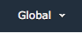
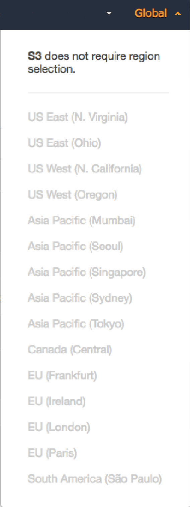
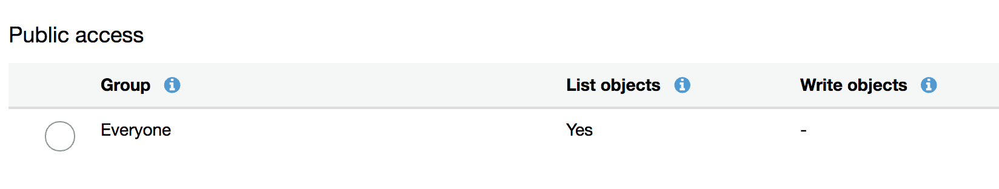
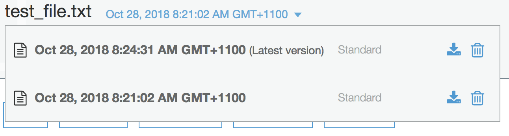
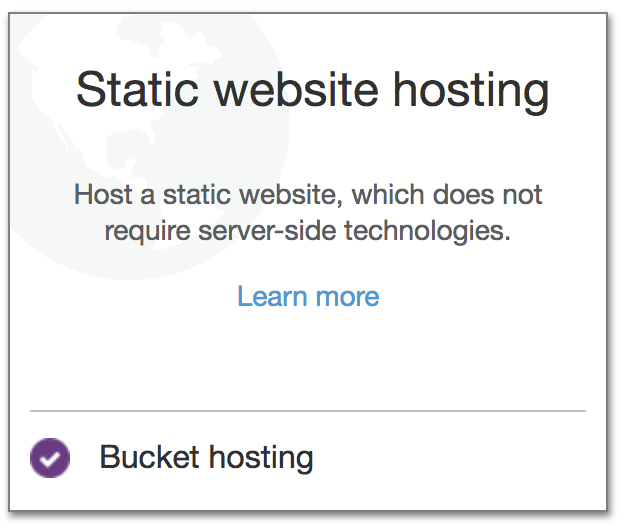

# AWS S3 Lab
This lab is part of the [foundations trainings](https://github.com/octo-technology-downunder/octo-au-foundations) at [OCTO Technology Australia](http://careers.octo.com.au/).
In this lab we'll go though the following topics:
- Working with AWS Simple Storage Service (S3) via AWS Console and aws cli
- Creating/deleting buckets
- Working with files in buckets
- Managing Permissions, Versioning
- Static website in S3 bucket

## Accessing S3 via AWS Web Console
1. Open https://console.aws.amazon.com/ and log in to your AWS account 
 
1. Select Services -> S3 in drop down menu or search for S3 in service finder 
1. In opened page you'll see the list of buckets available in current AWS account

AWS web console provide intuitive and straightforward controls, you can easily manage buckets and objects inside buckets, performing create/read/update/delete operations 

NOTE that S3 is displayed as "global" service 
 
 
To be precise, that means following things:
* Buckets are visible across all regions within AWS account
* Bucket names are unique across all AWS accounts worldwide
* Even though it's 'global', bucket still requires a region to be specified at creation time. That means objects in the bucket will be placed in multiple Availability zones of defined region

## Working with buckets and objects via aws cli
In order to access AWS services via CLI, awscli tool needs to be installed and configured. 
- Installation: follow the installation guide available here: https://docs.aws.amazon.com/cli/latest/userguide/installing.html
- Configuration: follow the configuration guide here: https://docs.aws.amazon.com/cli/latest/userguide/cli-chap-getting-started.html

Once awscli is installed and configured, let's run some cli commands against aws S3:

* List all S3 buckets in AWS account:

    `aws s3 ls`
    
    Here we call `aws` tool with following format: `aws <service> <command>`
    Check that aws command output shows the same data as web console 
* Create new S3 bucket for our lab (replace <your_name> with your quadrigram):

    `aws s3 mb s3://temp-foundation-labs-s3-<your_name>`

    Here we created a bucket called `temp-foundation-labs-s3-<your_name>`
* Put a file to the bucket:

    `touch test_file.txt` 
    
    `echo "Hello AWS S3\!" > test_file.txt` 
    
    `aws s3 mv test_file.txt s3://temp-foundation-labs-s3-<your_name>`
    
    We just created a file `test_file.txt` and moved it to our S3 bucket 
* Let's see the objects in our bucket:
    
    `aws s3 ls temp-foundation-labs-s3-<your_name>`
    
    It should return the list of objects in our bucket, namely `test_file.txt` 
* We can also move objects inside s3:

    `aws s3 mv  \ ` 
    `s3://temp-foundation-labs-s3-<your_name>/test_file.txt  \ ` 
    `s3://temp-foundation-labs-s3-<your_name>/prefix/test_file.txt`
    
    Please note, that in fact this command has not created any objects in S3. It only updated _key_ of the object in S3. So, now our `test_file.txt` has _key_ equal to `prefix/test_file.txt`  
    At the same time, web console handles such kind of keys with `/` in it as hierarchy, making objects navigation more traditional

# Managing permission
By default all files and buckets are created with private access permissions. This can be changed via both console and cli. 
### To change bucket's permissions via console: 
* Goto AWS console, select S3 service
* Navigate to `temp-foundation-labs-s3-<your_name>` bucket, then `Permissions` tab
* In `Public access` section click on `Everyone` and tick `List objects` checkbox 
 
Now any AWS account has read access to this bucket.

# Versioning
AWS S3 can track versions of the objects in buckets. By default this feature is turned off. To enable that, we'll use AWS console.
### To enable object's versioning via console: 
* Goto AWS console, select S3 service
* Navigate to `temp-foundation-labs-s3-<your_name>` bucket, then `Properties` tab
* In the `Versioning` box click `Enable versioning`, then `Save`

Now, let's see versioning working:
* Create new version of `test_file.txt` locally:

    `touch test_file.txt` 
    
    `echo "Hello AWS S3\!\\nThis is Version 2" > test_file.txt` 
* Copy new version of the file to AWS S3 under the same name:

    `aws s3 cp test_file.txt s3://temp-foundation-labs-s3-<your_name>/prefix/test_file.txt`

* In AWS console, go to your object in S3: `temp-foundation-labs-s3-<your_name>/prefix/test_file.txt`
* Next to the file name you'll see a version name (will show `Latest version`) and dropdown contol, which allows to navigate through the  versions of the file 
 

# Static website
AWS S3 allows creating static websites off the bucket content. Let's create a simple page and host it on our S3 bucket.
* Create `index.html` page and load it to S3:

    `touch index.html` 
    
    `echo "\ ` 
    `<html>\ ` 
    `<head></head>\ ` 
    `<body><h2>Hello OCTO\! This is my AWS S3 static website\!</body>\ ` 
    `</html>" > index.html`
    
    `aws s3 cp index.html s3://temp-foundation-labs-s3-<your_name>`
* In AWS console, navigate to `temp-foundation-labs-s3-<your_name>` bucket, then `Properties` tab
* Click `Static website hosting` box, then `Use this bucket to host a website`
* Type `index.html` in `Index document` field, then click `Save` 
 

Done! We just created a website!  
To access our site click again on `Static website hosting`, then copy Endpoint URL. It should look like `http://temp-foundation-labs-s3-<your_name>.s3-website-ap-southeast-2.amazonaws.com`
Try to open that in your browser 

Got an error? Something like `403 Forbidden` ?? 

Don't worry, that's because all files, uploaded to S3 are given private access permissions. And our `index.html` got the same as well 
Just go to the AWS consoile and change `index.html` permissions to public read-only 
Now try accessing a website endpoint once again 
###Success?? HOOORAAAAY!!!! 
 

# Cleaning up the resources
To clean up all created resources, simply remove the bucket:
* Go to the home page of AWS S3 service, that should display a list of buckets in AWS account.
* Find your `temp-foundation-labs-s3-<your_name>` and click on that row (not on the text itself). That should select your bucket in the list
* Click `Delete bucket` at the top of the page. This will display a confirmation window and a set of warnings regarding non-empty bucket, website associated with this bucket etc.
* Type in a bucket name which you want to delete. In our case it's `temp-foundation-labs-s3-<your_name>`. Press `Confirm`

This should remove the bucket along with files in it and a website. 

# Conclusion
This concludes our AWS S3 lab 
Feel free to create issues if you found any problems or have suggestions on the lab improvements 
Also don't hesitate to submit pull requests to this repo ;)  
 