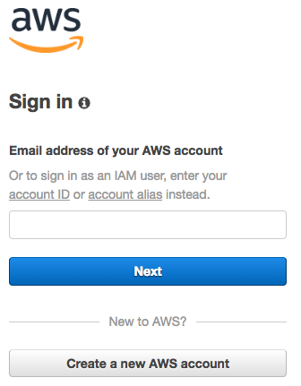

# AWS S3 Lab
This lab is part of the [foundations trainings](https://github.com/octo-technology-downunder/octo-au-foundations) at [OCTO Technology Australia](http://careers.octo.com.au/).
In this lab we'll go though the following topics:
- Working with AWS Simple Storage Service (S3) via AWS Console and awscli
- Creating/deleting buckets
- Working with files in buckets
- Static website in S3 bucket
- Permission, Versioning, Encryption

## Accessing S3 via AWS Console
1. Open https://console.aws.amazon.com/ and log in to your AWS account.

1. Select Services -> S3 in drop down menu or search for S3 in service finder 
1. In opened page you'll see the list of buckets available in current AWS account

NOTE that S3 is displayed as "global" service. To be precise, that means following things:
* Buckets are visible across all regions within AWS account
* Bucket names are unique across all AWS accounts worldwide
* Even though it's 'global', bucket still requires a region to be specified at creation time. That means objects in the bucket will be placed in multiple Availability zones of defined region

## Accessing S3 via awscli
In order to access AWS services via CLI, awscli tool needs to be installed and configured. 
- Installation: follow the installation guide available here: https://docs.aws.amazon.com/cli/latest/userguide/installing.html
- Configuration: follow the configuration guide here: https://docs.aws.amazon.com/cli/latest/userguide/cli-chap-getting-started.html

Once awscli is installed, let's run some commands against aws S3:
1. Run 
